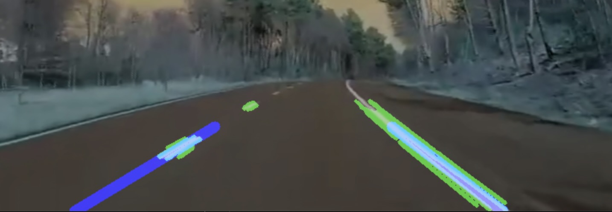

# Road Lane Detection

When driveing a vehicle, we use our eyes to decide where to go. Road Lines acts as a constant reference for where to steer our vehicles. Makeing it naturally to be one of the first things to develop a self-driving car is to detect lane lines automatically using an algorithm.

**Output**

<kbd></kbd>

Special thanks towards NikolasEnt's [Advanced-Lane-Lines/LaneLine.ipynb](https://github.com/NikolasEnt/Advanced-Lane-Lines/blob/master/LaneLine.ipynb),
naokishibuya's [car-finding-lane-lines](https://github.com/naokishibuya/car-finding-lane-lines) 
and Dmytro Nasyrov's [Road Lanes Recognition With OpenCV, Python, and iOS](https://medium.com/pharos-production/road-lane-recognition-with-opencv-and-ios-a892a3ab635c)
for contributing in depth research and easy to understand explanations on how to detect Road lines.
